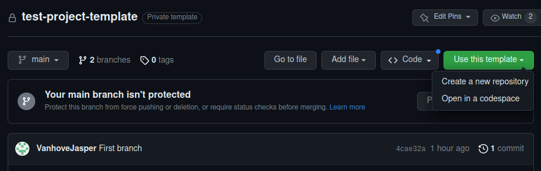
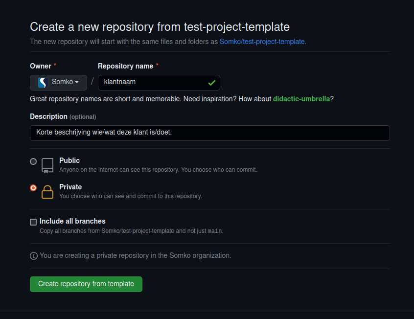

# Odoo Project Template

This is a template for a new Odoo project. Every Odoo version has its own branch.

## Aanmaken nieuwe repository

Om een nieuwe repository op te zetten voor een klant kunnen we volgend stappenplan gebruiken:

1. Ga naar [Somko Project Template](https://github.com/Somko/test-project-template).
2. We make gebruik van de 'Use this template' knop ipv de repository te clonen.



3. We zorgen ervoor dat de owner ‘Somko’ is en vullen de klantnaam in als repository.



4. Indien u de laatste versie van Odoo gebruikt kunt u ‘Include all branches’ uitgevinkt laten. Indien u een specifieke versie wilt zult u deze wel moeten aanvinken.
5. Klik vervolgens op ‘Create Repository’.

## Verwijderen van de overige branches

Indien uw project niet van de laatste versie is, zal u alle branches mee gecreerd hebben. Deze hebben we niet nodig en kunnen we dus verwijderen aan de hand van volgende stappen:

1. We halen ons nieuw project binnen in Pycharm.
2. We veranderen de branch naam van onze default branch naar 'remove_me'. Dit doen we aan de hand van het commando ```git branch -m remove_me```.
3. We veranderen de naam van de branch met de juiste Odoo versie, naar onze default branch aan de hand van het commando ```git branch -m <versie> main```.
4. We navigeren nu naar onze default-branch met “git checkout main”.
5. We verwijderen al onze branches behalve onze nieuwe “main” branch. Dit kan met het commando ```git branch | grep -v "main" | xargs git branch -D```.
6. We pushen nu onze wijzigingen naar github, ```git push -f --all```.
7. Als laatste moeten we nu de branch van onze versie nog verwijderen. Dit met het commando ```git push origin --delete <versie-naam>```.

Nu zou enkel de main branch nog moeten bestaan. We maken ook een nieuwe branch “qa” aan van de main branch en pushen deze naar de repository. Vanaf nu kunnen we starten met development.
